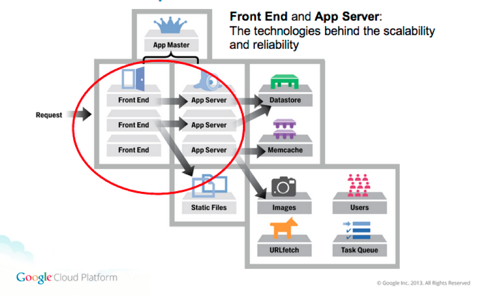

# Architecture

## Modularity

The Translation Proxy is based over Google's AppEngine infrastructure, split into frontend and backend modules. Each module encompasses variable numbers of instances, scaling automatically in response to demand. Modules are versioned and deployed separately, and can be switched independently, if needed.

Frontend instances serve requests from visitors to translated pages (in addition to serving the Dashboard and providing user-facing functionality).  
Requests are routed to the Proxy Application via the CNAME records created during the publishing process.

Backend modules are responsible for billing, statistics aggregation, and handling potentially long-running tasks, like XML import-export. Backend instances are not directly addressable, and provide no user-facing interaction.

## Underlying technologies

Immediately underlying the Proxy Application is the AppEngine infrastructure, responsible for rapidly scaling the deployed application. AppEngine also handles communication with the Google Cloud Datastore, a high-replication NoSQL database acting as the main persistent storage; as well as the Google Cloud Storage system, an also-distributed long-term storage. Logging is provided by Google Cloud Logging, while BigQuery provides rapid search ability in the saved logs on request.

Encompassing the entire application is the Google EdgeCache network, proactively caching content in various data centers located regionally to the request originator. Any content bearing the appropriate headers (`Cache-control:public; max-age=/\d+/` and `Pragma:public` - both are required) is cached by the EdgeCache for as long as needed, for requests originating in the same geographic area.

The current instance of the Proxy Application is hosted in the US central region, as a multi-tenant application (serving multiple users, but dedicated to proxying). However, single-tenant deployments (dedicated to a single user),  special deployments to other regions (EU or Asia), or internal systems fulfilling the AppScale system requirements can be discussed on a per-request basis.
