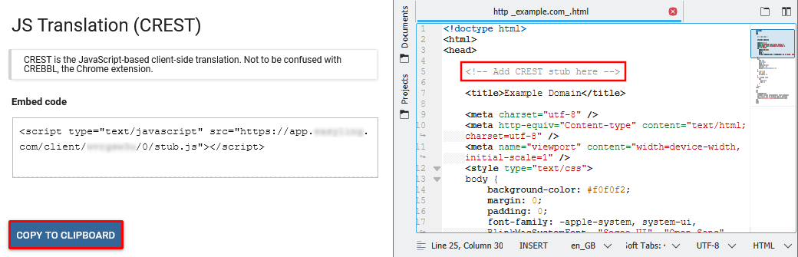

# Client-Side Translator

## Operations

### Overview

The _Client-Side Translator_, codenamed _Crest_, is an alternative publishing mode. Instead of operating in proxy mode, the system generates a JavaScript stub that needs to be referenced in the site, and it will translate the page in real time using a dictionary downloaded from the cloud service. Language choice is persisted in the browser's _Local Storage_, enabling automatic translation of any page in the site instantly on landing.

### Setup

Content is collected and translated the same way as normal. Once publishing is needed, content is exported by selecting the _Client-side translation_ file format, then publishing the latest export (or the one selected for production) from the _Previous Exports_ screen and clicking the context menu.

The translation loader script can be inserted with a one-liner script element, which is available from the _Global Settings_ screen of the _Publish_ section in the sidebar. The website owner needs to insert this script element into pages requiring translation.



Once complete, the translations can be requested by adding a query parameter to the URL, with the name `__ptLanguage` and the chosen locale as the value (for example `https://example.com/path/to/page?__ptLanguage=ja-JP`).

## Integrators' Guide

### Elements

_Crest_ is controlled by the loader script, inserted into every page requiring translation. The script element should be inserted as high in the `head` as possible in order to begin translation at the earliest possible point.  
The loader script has a number of query parameters that may be used to manipulate its operation. Any number of these can be combined to customize the loader's behavior from the default settings (existence of said defaults also means _none_ of these parameters are mandatory to supply).

- `languageParameter`: This parameter can be used to change the language selector key from its default of `__ptLanguage`.
- `storageParameter`: This parameter can be used to change the LocalStorage key used to store a previous selection from its default of `ptLanguage`.
- `noXDefault`: if set to `true`, suppress placing an `x-default` link element in the `head` if a translated language is loaded. This may have SEO implications!
- `rewriteUrl`: if set to `true`, use `history.replaceState` to rewrite the URL shown to the user so that it always displays the selected language.
- `scriptUrlIsBase`: if set to `true`, the loader will search for the translator script based on its own URL. **CAUTION: This is not supported under Internet Explorer!**
- `disableSelector`: if set to `true`, the stub will not inject its own language selector in the sidebar. In this case, it is up to the website to provide links to the various language versions.
- `manuallyStarted`: if enabled, the stub will load the appropriate translation engine, but will hold off on the _actual translation_ until the page calls `window.crestTranslator.start()` - see the events below for synchronizing this process!
- `passive`: if enabled, this option turns over full control of the translation process to the page - the loader will expose its API, but will not start any manipulation processes until the appropriate methods are called. See below for an example!

Language selection is possible via the sidebar inserted on the right by default, or custom `a` elements that manipulate the value of the `__ptLanguage` query parameter. Note that once a language is selected, the choice is persisted into the browser _Local Storage_, so further links need not be annotated with the query to maintain translation.

On selecting a language, the loader script will insert a new script element referencing the exported dictionary. It downloads the translations necessary for display and the translator algorithm that processes the available DOM to replace content with the available translations.  
The translator will also attach a `MutationObserver` to the document being displayed that allows it to react to DOM manipulation or newly-appearing elements in real time.

### Interop

#### Events

In order to provide a seamless user experience, _Crest_ exposes a number of events at key points in the process that allow the containing page to react to the translation process and take action to enhance the experience. The following events are dispatched at various points:

- `crestTranslatorAvailable`: This event is dispatched _only_ if manual translation start is enabled. It signals that the translation engine is ready and it's now safe to call `window.crestTranslator.start()` to begin the translation process. Note that `window.crestTranslator` is _only_ available if `manuallyStarted` has been set!
- `crestDictionaryLoadingStart`: Dispatched when a language is selected and download of the corresponding dictionary begins. As the dictionary can be sizeable, this event can be used to display a notification to the visitor advising them that the language is about to change.
- `crestDictionaryLoadingEnd`: Dispatched on completion of the dictionary download. Firing this event means translations are available, and they will be applied to the DOM momentarily. If a notification was displayed on download start, it should be removed on this event.
- `crestDocumentTranslationStart`: Dispatched when the initial translation of the document begins. Firing this event means translations are currently being applied to the entire page, and the displayed language is about to change. In case translation takes significant time, the user may benefit from an overlay or other message notifying them of the process and that the displayed language will change soon.
- `crestDocumentTranslationEnd`: Dispatched when the initial translation of the DOM is complete, and all available content has been replaced. At this point, the page is translated to the best of _Crest_'s abilities, and if an overlay or notification was displayed, it should be removed.
- `crestMutationTranslationStart`: Dispatched when a mutation of the DOM is detected by the attached observer and translation of the new/changed elements begins. This event is unique in that it includes a payload, an array of the `MutationRecord`s that are being processed. These include information about the element name, DOM path, and other data that may be used by the page to react to changes.
- `crestMutationTranslationEnd`: Dispatched when the mutation observer completes its run and designates all mutated elements translated. If a notification was displayed on the preceding event, it should be removed now.

In addition, the `crestStub` event can be used to detect changes in the loader configuration in real-time.

##### Example

```html
<script type="application/javascript">
    document.addEventListener("crestDocumentTranslationStart", () => console.log("Document translation started"));
    document.addEventListener("crestDocumentTranslationEnd", () => console.log("Document translation ended"));
    // e.detail.targets contains the array of MutationRecord objects that are being processed in the current run. For more information, see https://developer.mozilla.org/en-US/docs/Web/API/MutationRecord
    document.addEventListener("crestMutationTranslationStart", (e) => console.log(`Mutation translation started. Mutated records: ${e.detail.targets}`));
    document.addEventListener("crestMutationTranslationEnd", () => console.log("Mutation translation ended"));
    document.addEventListener("crestDictionaryLoadingStart", () => console.log("Dictionary download started"));
    document.addEventListener("crestDictionaryLoadingEnd", () => console.log("Dictionary download ended"));

    document.addEventListener("crestStub", (event) => {
        let changes = event.detail.changes; // List of changes in the state.
        let selectedLanguage = event.detail.state.selectedLanguage; // The currently selected language.
    });

    
    console.log("Event listeners ready...");
</script>
```

#### Passive Mode

In passive mode, the loader will remain mostly dormant until its API is called. The only thing it will do is to expose said API at `window.crestStub`. The API contains the following methods:

- `setCurrentLanguage(string)`: when called with an appropriate locale code, such as `ja-JP` - note the capitalization! - that is enabled for the hosting project, the loader will persist this choice and load the appropriate translation engine.  
Notably, this method also takes the _source language_ of the site, allowing the page to switch back to its original language by passing it to this method.
- `getCurrentLanguage()`: returns the locale code of the language currently selected.
- `languages`: contains the currently-enabled languages for the hosting project, which could be used to generate a custom language selector menu. For more information and precise structure, see below!

## Language selector

Language selectors are crucial for localised websites to ensure that the translations are prominently featured on the website. Crest is compatible with two types of language selector - a dropdown or a sidebar.

### Sidebar

The sidebar language selector is the easiest to integrate. It is part of the loader script, `stub.js`, so no further set-up is needed. It'll insert the flag of available languages to the side for users to click. This option offers minimal configuration. The following options are available:

- The flags of each language.
- The name of the language(s) as displayed when hovered.
- The side the selector should show up.

### Dropdown

For websites where more customisation options are required, the dropdown language selector is available. Setup is slightly more involved:

1. Create and empty `span` or `div` with the class `el-dropdown` (or the one configured on the Dashboard).
2. Add the translator stub with the `?disableSelector` query set to `true` or edit the selector to include this query. While technically not _required_, this step ensures that you do not have two selectors on the website. Without the query, the stub will insert the sidebar language selector too.
3. On the Dashboard, under _Language selector_, select JavaScript publishing and Dropdown. Make sure to save the settings.  
Alternatively, you can copy the embed code available under _Language selector_ on the Dashboard and insert it just like you inserted the stub. It looks something like this:

```html
<script type="text/javascript" src="https://whitelabel.example.com/js/webtranslate/languageDropdown.js?code=r2d4ct3d&v=2"></script>
```

This selector has two main versions. You can select the one you prefer on the Dashboard. V1 shows the currently selected language and the rest of them are available through a drop-down selector. V2 on the other hand is more compact by default. It shows a globe icon (🌐), then the language choice is available via a more modern dropdown design.

V1 offers the following options:

- The flags of each language.
- The name of the language(s) as displayed when hovered.

Additionally with V2, you can specify whether the design should incorporate the flags of the languages.

### Custom Dropdown

The loader exposes its current configuration in the local window, by setting a *read-only* copy of it as `window.crestStub`. Developers can use it to generate custom language selectors and get vital information about the current state of the translation engine.

#### Structure:

- **config**: Contains configurations for Crest's operation.

  - **crestConfig**: Specific configurations for Crest's behavior.
  
    - `passive`: (Boolean) Determines if Crest operates in a passive mode.
    - `scriptInjections`: (Array) Scripts to be injected dynamically.
    - `languageSelectedByPath`: (Boolean) Defines if language should be determined by the URL path.
    - `selectorDisabled`: (Boolean) Determines if the language selector is disabled.

  - **restrictions**: Specifies restrictions on paths and translations.

    - `externalizedPathPrefixes`: (Array) Paths that should be externalized.
    - `pathPrefixMask`: (Array) Masks for path prefixes.
    - `externalizedQueryGlobs`: (Array) Glob patterns for externalizing query parameters.
    - `translationPathPrefixes`: (Array) Prefixes for translated paths.

  - **sheet**: (String) URL of the icon sheet used for flags.
  - **flagWidth**: (Number) Width of an individual flag icon.
  - **flagHeight**: (Number) Height of an individual flag icon.
  - **flagPixelRatio**: (Number) Pixel ratio for the flag icons.
  - **atlasWidth**: (Number) Total width of the flag icon atlas.
  - **languageParameter**: (String) The query parameter used to indicate language selection.
  - **appendTo**: (String) DOM selector where the language selector should be appended.
  - **deployed**: (Boolean) Indicates if the translation has been deployed.
  - **storageKey**: (String) Key used for storing selected language in local storage.
  - **disableSelector**: (Boolean) Determines if the language selector is disabled.

- **languages**: (Array) Contains a list of available languages for translation.

  - **country**: (String) The country for the specific language.
  - **language**: (String) The name of the language.
  - **direction**: (String) Text direction (`ltr` or `rtl`).
  - **deployPath**: (String) URL where the translated version is deployed.
  - **flag**: (Object) Contains the x and y positions of the flag in the icon sheet.
  - **targetLanguage**: (String) The target language code.
  - **uri**: (String) URL for the translation script of the respective language.
  - **displayName**: (String) Display name for the language.
  - **published**: (Boolean) Indicates if the language translation is published.

#### Usage

Developers can use the `window.crestStub` object to create custom language selectors. By iterating over the `languages` array, one can generate language options dynamically. The current selected language can be obtained from the `config.crestConfig.languageSelectedByPath` or by checking the URL (when `languageSelectedByPath` is true). Read the following section for further API details.

Example:

```javascript
const languages = window.crestStub.languages;
languages.forEach(lang => {
  console.log(lang.displayName); // Output the display name of each language
});
```

## API

The client-side translator exposes two global objects under `window`, `crestStub` and `crestConfig`. Let's check them out one-by-one.

### `window.crestStub`

This object contains the most important values and functions for the translation.

- `config`: Read-only information about the current configuration.
  - `appendTo`: The ID of the element where the sidebar language selector is added.
  - `atlasWidth`: The width of the flag atlas in pixels.
  - `crestConfig`: The translator's configuration as set on the JavaScript publishing of the Dashboard.
    - `blockSelector`: A string representation of the options set under Selectors -> Block selector.
    - `languageSelectedByPath`: Boolean whether Tweaks -> Select language by path is enabled.
    - `manuallyStarted`: Boolean whether Tweaks -> Start manually is enabled.
    - `partialUpdateDetectionEnabled`: When this is true and an element matched by the selector specified under `treatUnhandledOnChangeSelector` is changed, the translator script detects a scenario where only part of the text is changed. In this scenario, it will not try to re-translate the mixed-language text.
    - `partialMutationAdapterEnabled`: Similar to `partialUpdateDetectionEnabled`, when such partial change is detected, the translation script will restore the source language for the part that it had translated previously so that it can finally translate the homogenous-language content. It is assumed that the newly added part is in the source language.
    - `passive`: Boolean whether Tweaks -> Passive mode is enabled.
    - `scriptInjections`: An array of the options set under Injection.
    - `selectorDisabled`: Boolean whether the sidebar language selector is disabled. `false` by default to show the selector.
  - `deployed`: If set to `true`, the stub is optimised for a mixed mode where translation itself is handled by the proxy. As such, it will not add the translator script.
  - `flagHeight`: The height of the individual flags in the atlas in pixels.
  - `flagWidth` The width of the individual flags in the atlas in pixels.
  - `flagPixelRatio`: The ratio of pixels in the atlas relative to their displayed size. E.g. 2 if the flags are 64px wide but they are displayed in 32px wide spaces.
  - `languageParameter`: The query parameter used for changing the language. The default is `__ptLanguage`. This can be set under languageParameter in the Tweaks section.
  - `restrictions`: These properties specify whether the translator should work on the given page.
    - `externalizedPathPrefixes`: An array of strings where the path is externalised.
    - `pathPrefixMask`: An array of strings that the translation scope is limited to. Every page outside is considered externalised.
    - `translationPathPrefixes`: An array of strings where the translations are published in subdirectory mode.
  - `sheet`: The URL of the flag atlas.
  - `sourceReport`: The URL of the script used when the Report new content when the site isn't translated tweak is enabled.
  - `storageKey`: The key to use in LocalStorage for storing the currently selected language.
  - `visor`: Boolean stating whether the script is currently running in preview mode.
- `getCurrentLanguage`: Returns the current language, e.g. `en-gb`.
- `setCurrentLanguage`: Set the current language to the parameter.
- `isPageExternalized`: Returns whether the page is externalised.
- `languages`: An array of `Language` objects that are known on the project. This includes the source language and the target language(s). Each object contains the following:
  - `country`: The country associated with the given language in the language of the country, e.g. _United Kingdom_.
  - `direction`: Whether the language is left-to-right or right-to-left. Possible values are `ltr` and `rtl`.
  - `displayName`: The full name of the language, including country in the given language, e.g. _English (United Kingdom)_.
  - `flag`: The `x` and `y` coordinates of the flag in the atlas.
  - `language`: The name of the language without the country in the given language, e.g. _English_.
  - `published`: A Boolean value stating whether a JS export is available.
  - `targetLanguage`: The (usually) four-letter locale code of the language, e.g. `en-gb`.
  - `uri`: The URI of the translator script of the given language.

### `window.crestTranslator`

Note that this object is only available if it has data to display (e.g. the _Start manually_ option is enabled on the Dashboard). It exposes a field and a function:

- `start()`: This function is used when the _Start manually_ option is enabled. In this scenario, use the `start()` function to start translation. It takes no parameters.
- `sourceReporter`: This Boolean value shows whether the _Report new content when the site isn't translated_ is enabled and active.
